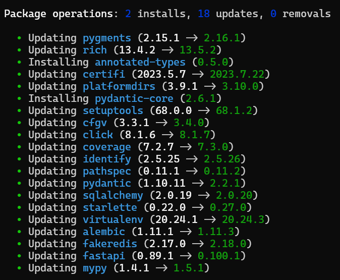

# xray_swagger

This project was generated using fastapi_template.

## Poetry

This project uses poetry. It's a modern dependency management
tool.

To run the project use this set of commands:

```bash
poetry install
poetry run python -m xray_swagger
```

This will start the server on the configured host.

You can find swagger documentation at `/api/docs`.

You can read more about poetry here: https://python-poetry.org/

## Docker

You can start the project with docker using this command:

```bash
docker-compose -f deploy/docker-compose.yml --project-directory . up --build
```

If you want to develop in docker with autoreload add `-f deploy/docker-compose.dev.yml` to your docker command.
Like this:

```bash
docker-compose -f deploy/docker-compose.yml -f deploy/docker-compose.dev.yml --project-directory . up --build
```

This command exposes the web application on port 8000, mounts current directory and enables autoreload.

But you have to rebuild image every time you modify `poetry.lock` or `pyproject.toml` with this command:

```bash
docker-compose -f deploy/docker-compose.yml --project-directory . build
```

## Project structure

```bash
$ tree "xray_swagger"
xray_swagger
├── conftest.py  # Fixtures for all tests.
├── db  # module contains db configurations
│   ├── dao  # Data Access Objects. Contains different classes to interact with database.
│   └── models  # Package contains different models for ORMs.
├── __main__.py  # Startup script. Starts uvicorn.
├── services  # Package for different external services such as rabbit or redis etc.
├── settings.py  # Main configuration settings for project.
├── static  # Static content.
├── tests  # Tests for project.
└── web  # Package contains web server. Handlers, startup config.
    ├── api  # Package with all handlers.
    │   └── router.py  # Main router.
    ├── application.py  # FastAPI application configuration.
    └── lifetime.py  # Contains actions to perform on startup and shutdown.
```

## Configuration

This application can be configured with environment variables.

You can create `.env` file in the root directory and place all
environment variables here.

All environment variables should start with "XRAY_SWAGGER_" prefix.

For example if you see in your "xray_swagger/settings.py" a variable named like
`random_parameter`, you should provide the "XRAY_SWAGGER_RANDOM_PARAMETER"
variable to configure the value. This behaviour can be changed by overriding `env_prefix` property
in `xray_swagger.settings.Settings.Config`.

An example of .env file:
```bash
XRAY_SWAGGER_RELOAD="True"
XRAY_SWAGGER_PORT="8000"
XRAY_SWAGGER_ENVIRONMENT="dev"
```

You can read more about BaseSettings class here: https://pydantic-docs.helpmanual.io/usage/settings/

## Pre-commit

To install pre-commit simply run inside the shell:
```bash
pre-commit install
```

pre-commit is very useful to check your code before publishing it.
It's configured using .pre-commit-config.yaml file.

By default it runs:
* black (formats your code);
* mypy (validates types);
* isort (sorts imports in all files);
* flake8 (spots possible bugs);


You can read more about pre-commit here: https://pre-commit.com/

## Migrations

If you want to migrate your database, you should run following commands:
```bash
# Upgrade database to the last migration.
aerich upgrade
```

### Reverting migrations

If you want to revert migrations, you should run:
```bash
aerich downgrade
```

### Migration generation

To generate migrations you should run:
```bash
aerich migrate
```


## Running tests

If you want to run it in docker, simply run:

```bash
docker-compose -f deploy/docker-compose.yml -f deploy/docker-compose.dev.yml --project-directory . run --build --rm api pytest -vv .
docker-compose -f deploy/docker-compose.yml -f deploy/docker-compose.dev.yml --project-directory . down
```

For running tests on your local machine.
1. you need to start a database.

I prefer doing it with docker:
```
docker run -p "5432:5432" -e "POSTGRES_PASSWORD=xray_swagger" -e "POSTGRES_USER=xray_swagger" -e "POSTGRES_DB=xray_swagger" postgres:13.8-bullseye
```


2. Run the pytest.
```bash
pytest -vv .
```



